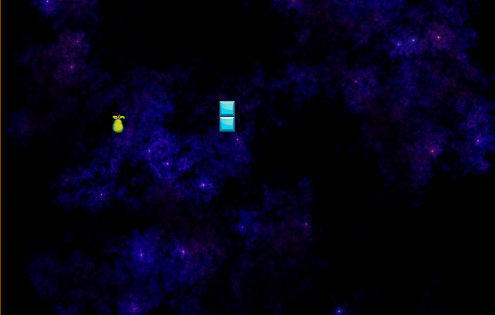

# Snake (WIP)

A simple snake game.

**Warnings**:

* I’m still a Haskell beginner, so I may do things wrong.
* Yes, snake can move and there is some food to eat, but the
  game is not finished yet ;)

## Credits

All credits to https://icrbow.itch.io/ who inspired me and built
the framework on which this game is based.

## Building

I’m using [NixOS](https://nixos.org/) for development so there
is a `shell.nix`, but you should be able to build it by
executing `make all`.

## Running

    make run

I have no idea if it runs on Windows or not… sorry.

## Issues

If you encounter crashes, glitches and other kinds of
game-breaking nasties, please add an issue. Describe the OS and
the hardware you're running the game on and mark if you're
willing to test hotfixes.

## Forking

Want a game of your own?
Take a look at https://gitlab.com/dpwiz/exstare – it is a much
better example of how to make one.

## Community

We would like to see more games in Haskell, so please join:

* https://www.reddit.com/r/haskellgamedev/
* https://discordapp.com/invite/vxpWtBA
